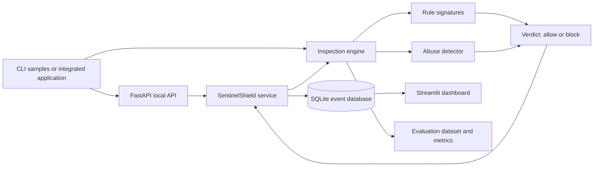
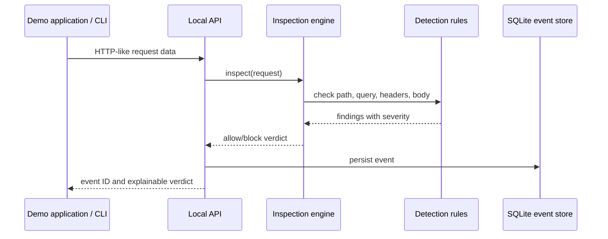

# SentinelShield Architecture

## Purpose

SentinelShield is an educational WAF/IDS prototype that makes rule-based request
inspection visible and testable. It is designed for a cybersecurity practical or
internship demonstration, not as a replacement for a production security gateway.

## Component diagram

## Request-processing flow

## Main modules

| Module | Responsibility |
| --- | --- |
| `models.py` | Immutable request, finding, severity, and verdict data models. |
| `rules.py` | Explainable rule signatures for five web-attack categories. |
| `engine.py` | Coordinates rule inspection and severity-based decisions. |
| `abuse.py` | Per-process rate limiting, login-burst, and confirmed authentication-failure tracking. |
| `events.py` | Local SQLite persistence for inspection events. |
| `service.py` | Application workflow: inspect, decide, and record. |
| `factory.py` | Builds configured service dependencies for the API and demo app. |
| `api.py` | Documented local integration endpoints. |
| `dashboard.py` | Visual review of stored events. |
| `evaluation.py` | Controlled TP/TN/FP/FN metric calculation. |

## Security decisions

- A `HIGH` or `CRITICAL` finding blocks by default; the threshold is configurable.
- A matching rule is an indicator, not proof of exploitation.
- The API’s `source_ip` field is demonstration data. A deployed system must obtain
  client identity from a trusted proxy or server runtime.
- The default abuse detector is in memory. It resets when the process restarts and
  is not suitable for a multi-server deployment.
- Oversized request fields are blocked before signature evaluation, but a deployed
  web server should also impose transport-layer request-size limits.
- SQLite is suitable for a local demonstration; a production design would use a
  centralized event pipeline with access control, retention, and integrity controls.
- Newly recorded local events have a SHA-256 hash chain for tamper visibility. It
  is not a replacement for protected, append-only or centralized audit logging.

## Test strategy

The unit suite covers normal requests, all five rule categories, request-rate
limits, login bursts, confirmed failures, database persistence, configuration, and
evaluation calculations. The evaluation dataset is intentionally small and must be
reported as a controlled baseline only.
